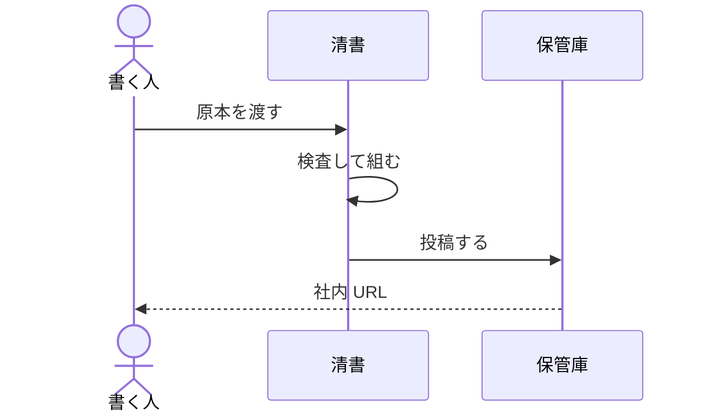

# 投稿までの流れ

書き手が原本を渡してから、社内 URL が出るまでの順番。

```mermaid
sequenceDiagram
  actor 書く人
  participant 清書
  participant 保管庫
  書く人->>清書: 原本を渡す
  清書->>清書: 検査して組む
  清書->>保管庫: 投稿する
  保管庫-->>書く人: 社内 URL
```

図のとおり、原本は清書を通ってから保管庫へ入る。

## 図が壊れる書き方

先に退避しないと、`actor 書く人` の行が段落として組まれてしまう。
